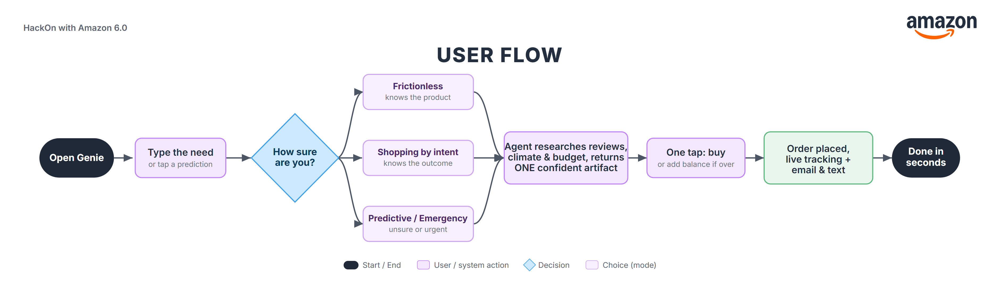
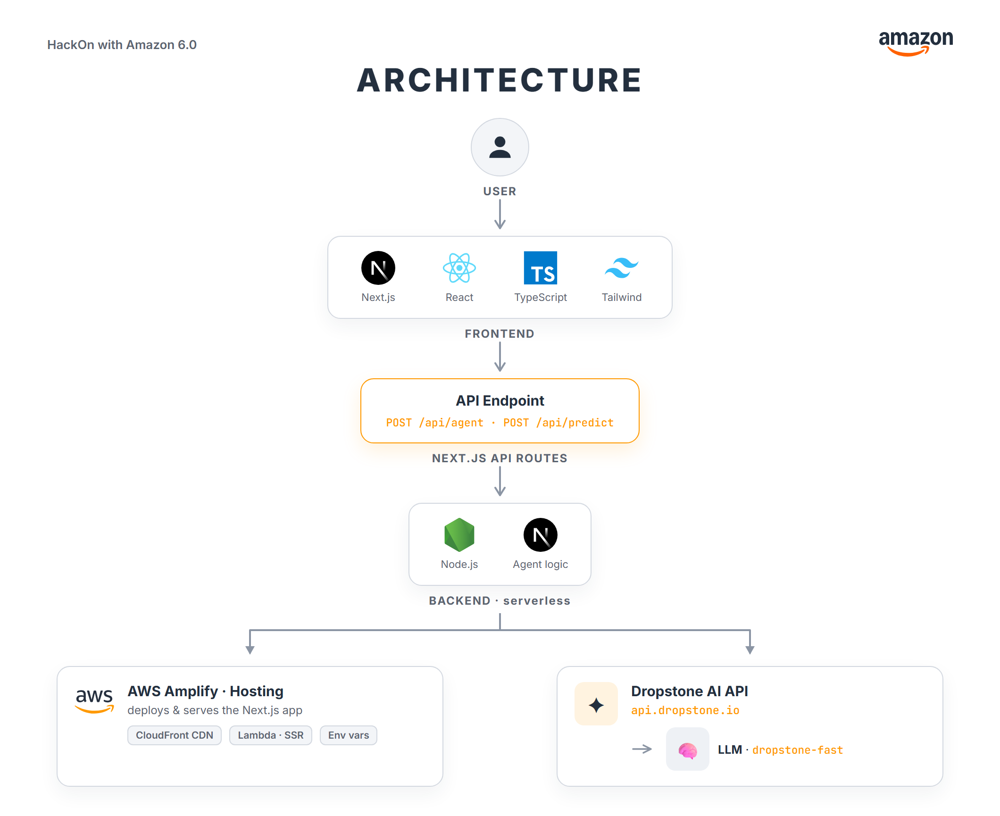

# 🧞 Genie, the agentic shopping assistant

> **Delivery is fast. Shopping isn't.** Genie makes shopping fast too: you text it like a friend, and it researches, decides within your budget, and buys, in seconds.

**Built for HackOn with Amazon 6.0** · Theme 2: *Amazon Now, Reimagining Urgent Shopping*

🔗 **Live App:** https://main.d3k3ndfy40rjf3.amplifyapp.com/
🎬 **Demo Video:** https://www.youtube.com/watch?v=x6Ft_8cO0Rg
💻 **GitHub:** https://github.com/santosharron/genie

---

## What is Genie

Amazon solved delivery, but shopping itself is still slow: you search, compare ten products, read reviews, second-guess yourself, and spend minutes (or give up) before deciding. The bottleneck isn't *finding*, it's *deciding with confidence*.

Genie is one agentic shopping assistant that meets you wherever you are on the "certainty spectrum" and returns **one confident result** instead of ten options, always inside your budget.

- **Frictionless** (you know the product): best pick + smart re-orders.
- **Shopping by Intent** (you know the outcome, not the products): it decomposes the goal into a vetted kit (e.g. a 6-day trip becomes rain gear + warm layers, chosen for *that* climate).
- **Predictive & Emergency** (you're unsure, or it's urgent): it predicts needs before you ask, and solves "right now" moments.

---

## Key features

- **One agent, four modes** with automatic certainty detection (frictionless / intent / emergency / clarify).
- **Visible research** that shows the agent checking the destination's weather, reading reviews, and comparing durability and price.
- **Budget-aware autonomy:** set a spending limit; Genie keeps every purchase under it (auto-buy small routine items, confirm bigger ones, or offer "add balance"), acting on your behalf.
- **One artifact, not a list:** a Decision card, Goal kit, Emergency pick, or Gift, with "why it fits you" and the one honest tradeoff.
- **Decide then do:** one tap to buy, then a live order tracker with email and text follow-up.
- **Proactive predictions and gifting:** it anticipates reorders and upcoming occasions (e.g. "Dad's 60th birthday is in 5 days") and picks thoughtful gifts by modeling the recipient.

---

## User flow



`Open Genie → Type the need → ◆ How sure are you? → (Frictionless / Intent / Predictive·Emergency) → Agent builds ONE confident artifact → One tap: buy → Order placed + live tracking → Done in seconds`

---

## Architecture



A Next.js app on AWS Amplify. The server API routes call the Dropstone API (an OpenAI-compatible LLM gateway) for reasoning. The API key stays server-side only, and the conversation is stateless (no database).

---

## Tech stack

| Layer | Technology | Why |
|---|---|---|
| **Frontend** | Next.js 15 (App Router), React, TypeScript, Tailwind CSS | Artifact-first UI, fast SSR + static, type-safe |
| **Backend** | Next.js serverless API routes (Node): `/api/agent`, `/api/predict` | Co-located, zero-ops, scales per request, keeps the key off the client |
| **AI** | Dropstone API (OpenAI-compatible) · production path: Amazon Bedrock | Reasoning over reviews, climate, and budget |
| **Infra** | AWS Amplify (Hosting + SSR via CloudFront + Lambda) | One-click CI/CD, global CDN, auto-scaling serverless |

**Key idea:** the budget math is **computed deterministically on the server and never trusted to the LLM**, so the agent can be trusted with money. Probabilistic reasoning is fenced off from financial correctness.

---

## Getting started (local)

### Prerequisites
- Node.js 18.18+ (20 recommended)
- A Dropstone API key (`dsk_...`)

### Setup
```bash
git clone https://github.com/santosharron/genie.git
cd genie
npm install
```

Create a `.env.local` in the project root:
```bash
# Dropstone LLM API (OpenAI-compatible)
DROPSTONE_SERVER_URL=https://api.dropstone.io
DROPSTONE_API_KEY=dsk_live_your_key_here
DROPSTONE_MODEL=dropstone-fast        # dropstone-fast | dropstone-pro | dropstone-heavy

# Optional: product image lookup (falls back to bundled images if unset)
# SERPAPI_KEY=your_serpapi_key
```

Run the dev server:
```bash
npm run dev
```
Open **http://localhost:3010**.

> The `DROPSTONE_API_KEY` is read **server-side only** and is never shipped to the browser. `.env.local` is gitignored.

---

## Deployment (AWS Amplify)

1. Push the repo to GitHub.
2. AWS Console → **Amplify** → **Host web app** → connect the repo + `main` branch (it auto-detects Next.js via `amplify.yml`).
3. Under **Hosting → Environment variables**, add `DROPSTONE_SERVER_URL`, `DROPSTONE_API_KEY`, `DROPSTONE_MODEL`.
4. Deploy. Amplify serves the static UI via CloudFront and runs the API routes on Lambda.

> `amplify.yml` writes the env vars into `.env.production` at build time so the Next.js **server runtime** can read them (Amplify only injects console env vars at build time by default).

---

## Project structure

```
app/
  page.tsx            # the whole UI: landing, chat, artifact panel, wallet, predictions
  api/agent/route.ts  # the agent: certainty router + budget engine + artifact builder
  api/predict/route.ts# proactive need + gift predictions
components/
  artifacts/          # Decision card / Goal kit / Emergency renderers
  AgentWorking.tsx    # the "researching" console
  OrderTracking.tsx   # iOS-style live order tracker
lib/
  dropstone.ts        # LLM client (OpenAI-compatible)
  budget.ts           # deterministic budget engine
  wallet.ts           # spending profile
  predict.ts          # prediction logic + upcoming events
  image-map.ts        # local product images
public/products/      # bundled product photos
```

---

## Team

Team **Ferzo**, built at HackOn with Amazon 6.0 (48-hour hackathon).

| Name | College / University | Role |
|---|---|---|
| Shiv Akash S M | SRM-IST, Kattankulathur | Full-Stack Developer |
| Santosh V P | SRM-IST, Kattankulathur | AI & Backend |

---

*Genie: from "I need this" to "it's on the way", in seconds.*
